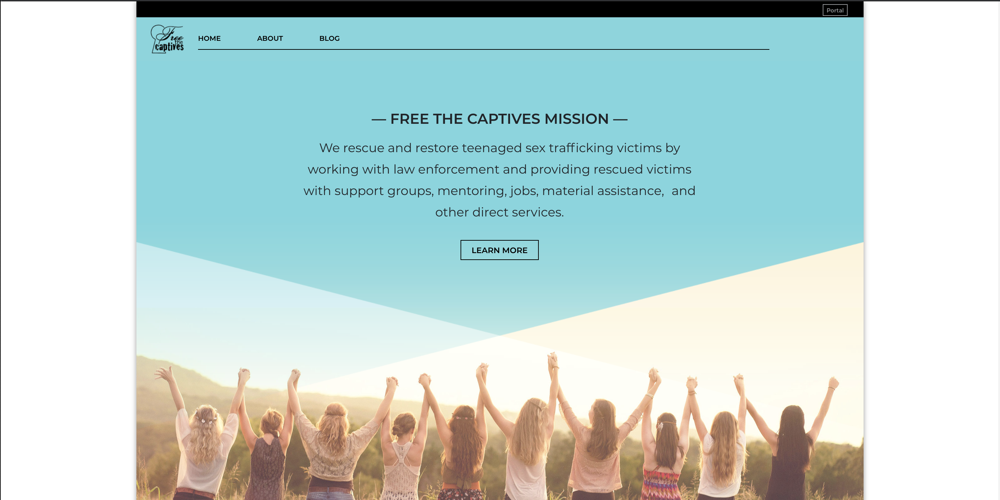

# Non-profit Website Redesign

## Description

This is a website redesign for an organization that are Houston based and work on fighting human sex trafficking. They rescue and restore teenaged trafficked victims, providing support groups, mentoring jobs, material assistance and other services.

Their current website has a good base and powerful images. However, there was room for improvement on the user interface on both desktop and mobile to better tell their story and make it easier for the user to get the idea of what they are about. This solution includes improvements to the positioning of images, hierarchy, pacing and spacing. 

## View Application:

* [https://website-redesign-nonprofit.herokuapp.com/](https://website-redesign-nonprofit.herokuapp.com/)
* [https://github.com/jennifoo/nonprofit-website-redesign](https://github.com/jennifoo/nonprofit-website-redesign)

## Technology

* Technologies used: React, Node, Express Web Server, Axios, Mongoose, dotenv (for protecting API key for TinyMCE)
* New Packages Utilized: Parallax, TinyMCE Text Editor, Passport (for user authentication), React HTML Parser
* Framework: React Bootstrap
